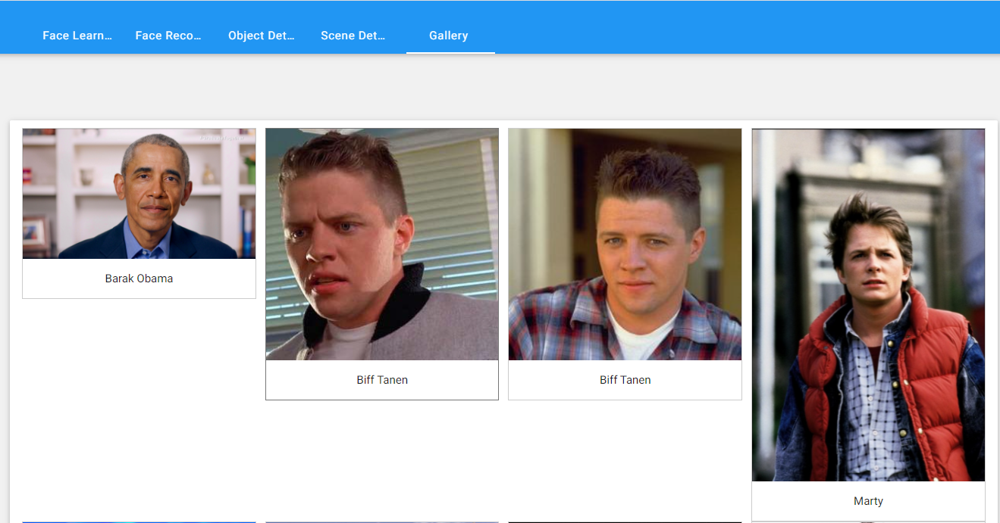
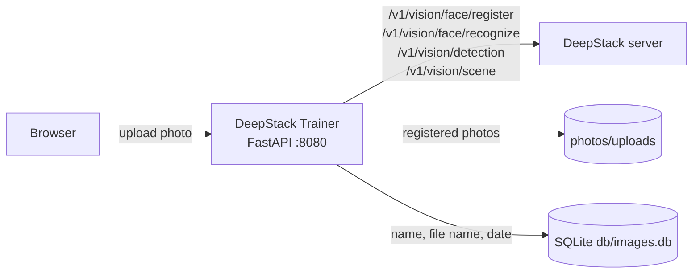

*Please :star: this repo if you find it useful*

<p align="left"><br>
<a href="https://www.paypal.com/paypalme/techblogil?locale.x=he_IL" target="_blank"></a>
</p>

# DeepStack Trainer

[](https://hub.docker.com/r/techblog/deepstack-trainer)
[](https://github.com/t0mer/deepstack-trainer/releases)

[DeepStack Trainer](https://github.com/t0mer/deepstack-trainer) is a [FastAPI](https://fastapi.tiangolo.com/)-powered web application that makes it as easy as possible to train and test a [DeepStack](https://github.com/johnolafenwa/DeepStack) AI server. Upload a photo and give it a name to register a face, then check how DeepStack recognizes faces, detects objects and classifies scenes, all from the browser and without writing any API calls yourself.

It is aimed at self-hosters who run DeepStack for home automation (for example with Home Assistant or Blue Iris) and want a simple UI to teach it faces.

### About DeepStack

[DeepStack](https://github.com/johnolafenwa/DeepStack) is an AI server that empowers every developer in the world to easily build state-of-the-art AI systems both on premise and in the cloud. The promises of Artificial Intelligence are huge, but becoming a machine learning engineer is hard. DeepStack is device and language agnostic. You can run it on Windows, macOS, Linux and Raspberry Pi, and use it with any programming language.

DeepStack's source code is available on GitHub: [https://github.com/johnolafenwa/DeepStack](https://github.com/johnolafenwa/DeepStack/). The original project website, deepstack.cc, is now offline.

## Table of Contents

- [Features](#features)
- [Screenshots](#screenshots)
- [How It Works](#how-it-works)
- [Requirements](#requirements)
- [Installation](#installation)
- [Configuration](#configuration)
- [Usage](#usage)
- [HTTP Endpoints](#http-endpoints)
- [Security Notes](#security-notes)
- [Troubleshooting](#troubleshooting)
- [Development](#development)
- [Integrations and Community](#integrations-and-community)
- [Contributing](#contributing)
- [License](#license)

## Features

- **Face registration (learning)** - upload a photo and a person's name to register the face with DeepStack.
- **Face recognition test** - upload a photo and see which registered people DeepStack recognizes in it.
- **Object detection test** - list the objects DeepStack detects in a photo.
- **Scene recognition test** - show the scene label DeepStack assigns to a photo.
- **Gallery** - browse every photo used for face registration, sorted by upload date, with the name of the person. From the gallery you can rename the label stored for a photo or delete the photo.
- **Configurable minimum confidence** for recognition, detection and scene results.
- **Optional DeepStack API key** support for protected DeepStack servers.
- Multi-arch Docker image (`linux/amd64`, `linux/arm64`, `linux/arm/v7`).

## Screenshots

### Face Learning (Registration)
[](screenshots/teach%20face.png)

### Face Recognition
[](screenshots/face%20recognition.png)

### Object Detection
[](screenshots/object%20detection.png)

### Scene Detection
[](screenshots/scene%20detection.png)

### Photo Gallery
[](screenshots/gallery.png)

## How It Works



- The web UI posts the selected image to the trainer, which saves it and forwards it to the matching DeepStack API.
- **Face registration:** the photo is kept in `photos/uploads` (with a UUID added to the file name to avoid overwriting) and a row with the person's name, file name and timestamp is written to the SQLite database `db/images.db`. If DeepStack rejects the photo, it is deleted again.
- **Recognition, object detection and scene tests:** the photo is saved temporarily and deleted as soon as DeepStack answers.
- The gallery reads the SQLite database and shows the stored photos.

### Components used in DeepStack Trainer

- [FastAPI](https://fastapi.tiangolo.com/) - for running the web server (served by [Uvicorn](https://uvicorn.dev/))
- [Materialize](https://materializecss.com/) - for web forms
- [SweetAlert2](https://sweetalert2.github.io/) - for alerts and messages
- SQLite - for storing the gallery metadata

## Requirements

- A running **DeepStack** server reachable from the trainer container, with the APIs you want to use enabled:
  - `VISION-FACE=True` - face registration and face recognition
  - `VISION-DETECTION=True` - object detection
  - `VISION-SCENE=True` - scene recognition
- Docker (or Docker Compose) to run the trainer image.
- The browser loads jQuery (from `ajax.googleapis.com`), Materialize, SweetAlert2 and Font Awesome from public CDNs, so the machine running the browser needs internet access for the UI to render correctly.
- The main page also loads Google Analytics (`gtag.js`), so each page view is reported to Google (see [Security Notes](#security-notes)).

## Installation

### DeepStack installation

To use DeepStack Trainer you first need a DeepStack server. You can start one with the following command:

```bash
docker run -e VISION-FACE=True -v localstorage:/datastore -p 80:5000 deepquestai/deepstack
```

Basic parameters:

* `-e VISION-FACE=True` - enables the face recognition APIs.
* `-v localstorage:/datastore` - the local volume where DeepStack stores all its data.
* `-p 80:5000` - makes DeepStack accessible via port 80 of the machine.

You can also install DeepStack using Docker Compose (this example enables face, object and scene APIs):

```yaml
services:
  deepstack:
    image: deepquestai/deepstack:latest
    restart: unless-stopped
    container_name: deepstack
    ports:
      - "80:5000"
    environment:
      - TZ=Asia/Jerusalem
      - VISION-FACE=True
      - VISION-DETECTION=True
      - VISION-SCENE=True
    volumes:
      - ./deepstack:/datastore
```

### DeepStack Trainer installation

The image is published on Docker Hub as [`techblog/deepstack-trainer`](https://hub.docker.com/r/techblog/deepstack-trainer) (tags `latest` and version tags taken from the `VERSION` file; the latest published version is `2.2.0`) for `linux/amd64`, `linux/arm64` and `linux/arm/v7`.

#### Docker Compose

```yaml
services:
  deepstack_trainer:
    image: techblog/deepstack-trainer
    container_name: deepstack_trainer
    restart: always
    environment:
      - DEEPSTACK_HOST_ADDRESS=http://deepstack:5000
      - DEEPSTACK_API_KEY=
      - MIN_CONFIDANCE=0.70
    ports:
      - "8080:8080"
    volumes:
      - ./deepstack-trainer/db:/opt/trainer/db # Database storing the uploaded photos data (file name, person name, date).
      - ./deepstack-trainer/uploads:/opt/trainer/photos/uploads # Physical path for storing the images
```

The example `http://deepstack:5000` assumes both services are in the same Compose file. Otherwise use the address of your DeepStack server, for example `http://192.168.1.10:80` for the `docker run` example above.

#### Docker

```bash
docker run -d --name deepstack_trainer \
  -p 8080:8080 \
  -e DEEPSTACK_HOST_ADDRESS=http://192.168.1.10:80 \
  -e DEEPSTACK_API_KEY= \
  -e MIN_CONFIDANCE=0.70 \
  -v $(pwd)/deepstack-trainer/db:/opt/trainer/db \
  -v $(pwd)/deepstack-trainer/uploads:/opt/trainer/photos/uploads \
  techblog/deepstack-trainer
```

#### Build from source

```bash
git clone https://github.com/t0mer/deepstack-trainer.git
cd deepstack-trainer
docker build -t deepstack-trainer .
```

The image is based on `techblog/fastapi:latest`, which provides the Python runtime and libraries.

## Configuration

All configuration is done through environment variables:

| Variable | Required | Default | Description |
|---|---|---|---|
| `DEEPSTACK_HOST_ADDRESS` | Yes | *(empty)* | Base URL of the DeepStack server, including scheme and port, without a trailing slash (for example `http://192.168.1.10:5000`). |
| `DEEPSTACK_API_KEY` | No | *(empty)* | API key of your DeepStack server if it is protected. Leave blank when DeepStack runs without a key. |
| `MIN_CONFIDANCE` | No | `0.70` | Minimum confidence (0-1) used for face recognition, object detection and scene recognition. Note the spelling `CONFIDANCE`, which is what the code reads. |

Fixed settings:

| Setting | Value |
|---|---|
| Listening port | `8080` (all interfaces) |
| Gallery database | `/opt/trainer/db/images.db` (SQLite, created automatically) |
| Registered photos | `/opt/trainer/photos/uploads` |
| Accepted image types | `jpg`, `jpeg`, `png`, `gif`, `bmp` |

Mount `/opt/trainer/db` and `/opt/trainer/photos/uploads` as volumes to keep the gallery across container updates. The faces themselves are stored by DeepStack in its own `/datastore` volume.

## Usage

After the container is up and running, open your browser and navigate to `http://<host>:8080`. You will see the following tabs:

1. **Face Learning** - choose a photo, enter the name of the person in it and click **Teach ME**. The photo is registered with DeepStack under that name and added to the gallery. Register several photos per person for better results.
2. **Face Recognition** - choose a photo and click **Who is it**. The trainer shows the names of the recognized people.
3. **Object Detection** - choose a photo and click **Detect Objects** to list the detected objects.
4. **Scene Detection** - choose a photo and click **Detect Scene** to show the scene label.
5. **Gallery** - shows all photos used for face learning. Click a photo to open it, click the name to edit it and save with the save icon, or use the delete icon to remove the photo.

> **Note:** renaming or deleting in the gallery only changes the trainer's own database and files. It does not rename or remove the face registered in DeepStack.

## HTTP Endpoints

These are the endpoints the web UI calls. FastAPI's automatic docs are also served at `/docs` and `/redoc`.

| Method | Path | Body | Purpose |
|---|---|---|---|
| `GET` | `/` | - | Main web UI. |
| `POST` | `/teach` | multipart: `person`, `teach_file` | Register a face with DeepStack and store the photo in the gallery. |
| `POST` | `/who` | multipart: `who_file` | Face recognition test. |
| `POST` | `/detect` | multipart: `detect_file` | Object detection test. |
| `POST` | `/scene` | multipart: `scene_file` | Scene recognition test. |
| `GET` | `/api/images` | - | Returns the gallery as an HTML fragment. |
| `POST` | `/api/rename` | JSON: `{"text": "<new name>", "img": "<file name>"}` | Rename the label of a gallery photo. |
| `POST` | `/api/delete` | JSON: `{"img": "<file name>"}` | Delete a gallery photo and its database row. |
| `GET` | `/uploads/<file name>` | - | Serves a registered photo. |

Response formats:

- `/teach`, `/who`, `/detect`, `/scene`, `/api/rename` and `/api/delete` return a **JSON-encoded string that itself contains JSON** with `success` (`"true"`/`"false"`) and either `message` or `error`. Clients must decode twice (the web UI calls `JSON.parse` on the already-parsed response).
- `/teach` can also return DeepStack's raw response object, or `null` when the file type is not accepted.
- `/api/images` returns `null` if the gallery cannot be read.

Example:

```bash
curl -F "who_file=@person.jpg" http://localhost:8080/who
```

## Security Notes

- The trainer has **no authentication**. Anyone who can reach port 8080 can register faces, view every uploaded photo and delete gallery entries. Run it only on a trusted network, or put it behind a reverse proxy with authentication.
- The DeepStack API key is read from an environment variable and sent to DeepStack in the request body. Use HTTPS or a trusted network between the trainer and DeepStack.
- The gallery photos are stored unencrypted on the mounted `uploads` volume.
- `/api/delete` builds the file path and the SQL statement from untrusted request input without validation, so a client that can reach the trainer can delete arbitrary files the container process can access and inject SQL into the gallery database.
- `/who`, `/detect` and `/scene` write and then delete the uploaded file using the file name sent by the client, without sanitizing it.
- Together with the missing authentication, this means the trainer must never be exposed to untrusted networks.
- The main page loads Google Analytics (`gtag.js`) on every page view, and jQuery is loaded from `ajax.googleapis.com`. Your browser therefore contacts Google each time the UI is opened. Block these domains if that is not acceptable.

## Troubleshooting

- **All requests fail with a connection error** - check `DEEPSTACK_HOST_ADDRESS`. Inside the container `localhost` points to the trainer itself, so use the DeepStack host IP or its Compose service name, and include the port.
- **An error like "Aw Snap! something went wrong"** - the trainer shows the error returned by DeepStack or the connection error. Make sure the needed DeepStack API (`VISION-FACE`, `VISION-DETECTION`, `VISION-SCENE`) is enabled and that `DEEPSTACK_API_KEY` matches your DeepStack server.
- **Upload fails or returns HTTP 500** - use `jpg`, `jpeg`, `png`, `gif` or `bmp` files. The file-type check is a loose substring test on the extension; a rejected type returns `null` on Face Learning and an HTTP 500 error on Face Recognition, Object Detection and Scene Detection.
- **Gallery is empty after an update** - mount `/opt/trainer/db` and `/opt/trainer/photos/uploads` as volumes (see [Installation](#installation)).
- The container logs (`docker logs deepstack_trainer`) show every step of each request.

## Development

Project layout:

```
trainer/
  trainer.py         # FastAPI app, routes and DeepStack client
  templates/         # Jinja2 templates (index.html, gallery.html)
  dist/              # static JS, CSS, images and fonts
screenshots/         # README screenshots
Dockerfile
VERSION              # version used for Docker image tags
```

Run locally without Docker (the repository has no `requirements.txt`; the packages below are taken from the imports in `trainer.py`):

```bash
pip install fastapi uvicorn requests loguru aiofiles jinja2 python-multipart
cd trainer
mkdir -p db photos/uploads
DEEPSTACK_HOST_ADDRESS=http://localhost:80 python3 trainer.py
```

The app then listens on `http://localhost:8080`.

Docker images are built by GitHub Actions: publishing a GitHub release builds and pushes `techblog/deepstack-trainer:latest` and `techblog/deepstack-trainer:<VERSION>`, where the tag comes from the `VERSION` file. Not every GitHub release has a matching image, and the current `VERSION` (`2.3.0`) has not been published yet.

## Integrations and Community

The DeepStack ecosystem includes a number of popular integrations and libraries built to expand the functionality of the AI engine to serve IoT, industrial, monitoring and research applications. Some of them are listed below:

* [HASS-DeepStack-Object](https://github.com/robmarkcole/HASS-Deepstack-object)
* [HASS-DeepStack-Face](https://github.com/robmarkcole/HASS-Deepstack-face)
* [HASS-DeepStack-Scene](https://github.com/robmarkcole/HASS-Deepstack-scene)
* [DeepStack with Blue Iris - YouTube video](https://www.youtube.com/watch?v=fwoonl5JKgo)
* [DeepStack with Blue Iris - Forum Discussion](https://ipcamtalk.com/threads/tool-tutorial-free-ai-person-detection-for-blue-iris.37330/)
* [DeepStack on Home Assistant](https://community.home-assistant.io/t/face-and-person-detection-with-deepstack-local-and-free/92041)
* [DeepStack-UI](https://github.com/robmarkcole/deepstack-ui)
* [DeepStack-Python Helper](https://github.com/robmarkcole/deepstack-python)
* [DeepStack-Analytics](https://github.com/robmarkcole/deepstack-analytics)
* [DeepStackAI Trigger](https://github.com/neilenns/node-deepstackai-trigger)

Faces registered with DeepStack Trainer are stored in DeepStack itself, so they are available to any of these integrations (for example the Home Assistant face component) that use the same DeepStack server.

## Contributing

Issues and pull requests are welcome. Please open an issue first for larger changes.

## License

This repository contains two license files: [`License`](License) (Apache License 2.0) and [`LICENSE`](LICENSE) (GNU General Public License v3.0). <!-- TODO: verify which license applies -->
